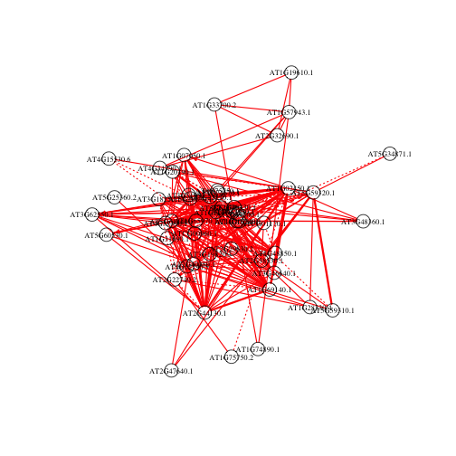
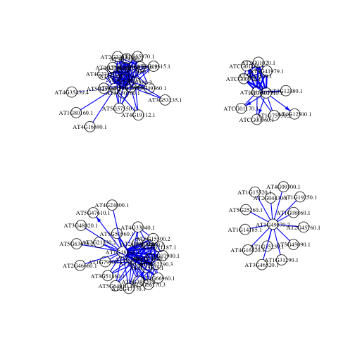
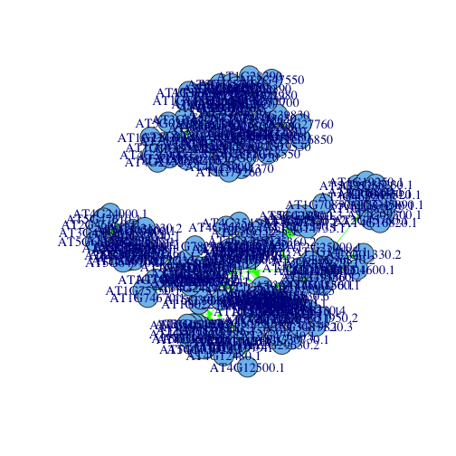
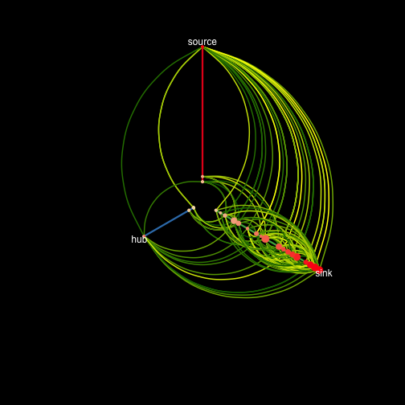
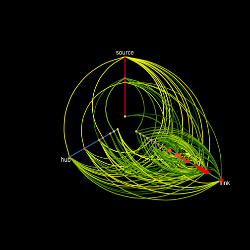
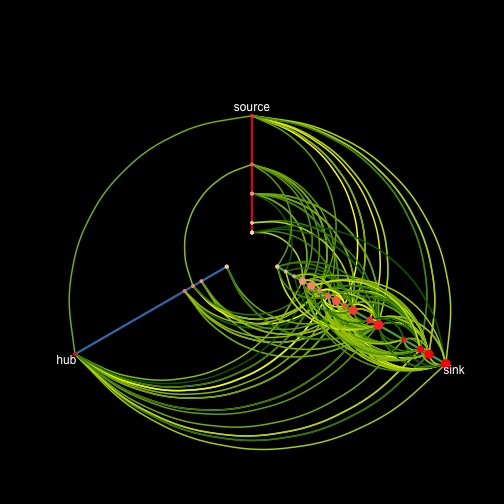
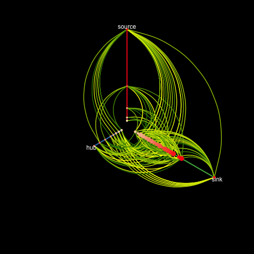
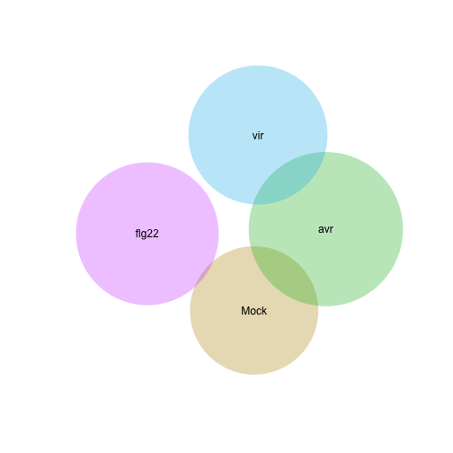

Title
========================================================


Firstly, load or install required packages...

```r
source("functions.R")
load_libraries()
```

```
## Loading required package: GeneNet
## Loading required package: corpcor
## Loading required package: longitudinal
## Loading required package: fdrtool
## Loading required package: igraph
## Loading required package: HiveR
## Loading required package: plyr
## Loading required package: venneuler
## Loading required package: rJava
```


Now, get the data from the file in the variable: `raw_filename`.


```r
# these data are FPKM from DOI: 10.1371/journal.pone.0074183
raw_filename = "~/Desktop/gene_nets/fpkm_data.csv"
data <- read.csv(raw_filename, header = TRUE)
```


Subset the FPKM into one `data.frame` for each treatment.


```r
# change 0s to NA
data[data == 0] <- NA

# subset
mock <- data[c("tracking_id", "MOCK_1_1", "MOCK_1_2", "MOCK_6_1", "MOCK_6_2", 
    "MOCK_12_1", "MOCK_12_2")]
avr <- data[c("tracking_id", "AVR_1_1", "AVR_1_2", "AVR_6_1", "AVR_6_2", "AVR_12_1", 
    "AVR_12_2")]
vir <- data[c("tracking_id", "VIR_1_1", "VIR_1_2", "VIR_6_1", "VIR_6_2", "VIR_12_1", 
    "VIR_12_2")]
```


Filter out genes that do not show `X` Fold or better change relative to the 1h timepoint and do not have complete data at each timepoint.

```r
x <- 10
mock <- get_diff_expressed(mock, x, "MOCK")
avr <- get_diff_expressed(avr, x, "AVR")
vir <- get_diff_expressed(vir, x, "VIR")

# make lists of gene names
mock_nodelabels <- get_nodelabels(mock)
avr_nodelabels <- get_nodelabels(avr)
vir_nodelabels <- get_nodelabels(vir)
```


Get some Affy array data in for FLG-22 treatments too


```r
flg22 <- read.table("~/Desktop/gene_nets/just_data_sig_in_both_time_points.txt")
flg22 <- as.matrix(flg22)
flg22 <- t(flg22)

flg22_nodelabels <- as.character(read.table("~/Desktop/gene_nets/node_labels_sig_in_both_times.txt")$V1)
```


How many genes are we using for each data set?


```r
data.frame(mock = length(mock_nodelabels), avr = length(avr_nodelabels), vir = length(vir_nodelabels), 
    flg22 = length(flg22_nodelabels))
```

```
##   mock avr vir flg22
## 1  686 821 783   620
```


Make the data structure for the PCC and GGM

```r
mock_long <- make_longitudinal(mock)
avr_long <- make_longitudinal(avr)
vir_long <- make_longitudinal(vir)
flg22_long <- as.longitudinal(flg22, repeats = c(3, 3), time = c(2, 4))
### check all went well...
is.longitudinal(mock_long)
```

```
## [1] TRUE
```


Generate the PCC and find `y` edges with a GGM

```r
y <- 250
mock_edges <- make_net(mock_long, y)
```

```
## Estimating optimal shrinkage intensity lambda (correlation matrix): 0.3636 
## 
## Estimate (local) false discovery rates (partial correlations):
## Step 1... determine cutoff point
## Step 2... estimate parameters of null distribution and eta0
## Step 3... compute p-values and estimate empirical PDF/CDF
## Step 4... compute q-values and local fdr
## Step 5... prepare for plotting
```

```
## 
## Estimate (local) false discovery rates (log ratio of spvars):
## Step 1... determine cutoff point
## Step 2... estimate parameters of null distribution and eta0
## Step 3... compute p-values and estimate empirical PDF/CDF
## Step 4... compute q-values and local fdr
## Step 5... prepare for plotting
```

```
## 
## 
## Significant edges:  250 
##     Corresponding to  0.11 %  of possible edges 
## 
## Significant directions:  14221 
##     Corresponding to  6.05 %  of possible directions 
## Significant directions in the network:  7 
##     Corresponding to  2.8 %  of possible directions in the network
```

```r
avr_edges <- make_net(avr_long, y)
```

```
## Estimating optimal shrinkage intensity lambda (correlation matrix): 0.3498 
## 
## Estimate (local) false discovery rates (partial correlations):
## Step 1... determine cutoff point
## Step 2... estimate parameters of null distribution and eta0
## Step 3... compute p-values and estimate empirical PDF/CDF
## Step 4... compute q-values and local fdr
## Step 5... prepare for plotting
```

```
## 
## Estimate (local) false discovery rates (log ratio of spvars):
## Step 1... determine cutoff point
## Step 2... estimate parameters of null distribution and eta0
## Step 3... compute p-values and estimate empirical PDF/CDF
## Step 4... compute q-values and local fdr
## Step 5... prepare for plotting
```

```
## 
## 
## Significant edges:  250 
##     Corresponding to  0.07 %  of possible edges 
## 
## Significant directions:  31614 
##     Corresponding to  9.39 %  of possible directions 
## Significant directions in the network:  4 
##     Corresponding to  1.6 %  of possible directions in the network
```

```r
vir_edges <- make_net(vir_long, y)
```

```
## Estimating optimal shrinkage intensity lambda (correlation matrix): 0.2631 
## 
## Estimate (local) false discovery rates (partial correlations):
## Step 1... determine cutoff point
## Step 2... estimate parameters of null distribution and eta0
## Step 3... compute p-values and estimate empirical PDF/CDF
## Step 4... compute q-values and local fdr
## Step 5... prepare for plotting
```

```
## 
## Estimate (local) false discovery rates (log ratio of spvars):
## Step 1... determine cutoff point
## Step 2... estimate parameters of null distribution and eta0
## Step 3... compute p-values and estimate empirical PDF/CDF
## Step 4... compute q-values and local fdr
## Step 5... prepare for plotting
```

```
## 
## 
## Significant edges:  250 
##     Corresponding to  0.08 %  of possible edges 
## 
## Significant directions:  11305 
##     Corresponding to  3.69 %  of possible directions 
## Significant directions in the network:  1 
##     Corresponding to  0.4 %  of possible directions in the network
```

```r
flg22_edges <- make_net(flg22_long, y)
```

```
## Estimating optimal shrinkage intensity lambda (correlation matrix): 0.1712 
## 
## Estimate (local) false discovery rates (partial correlations):
## Step 1... determine cutoff point
## Step 2... estimate parameters of null distribution and eta0
## Step 3... compute p-values and estimate empirical PDF/CDF
## Step 4... compute q-values and local fdr
## Step 5... prepare for plotting
```

```
## 
## Estimate (local) false discovery rates (log ratio of spvars):
## Step 1... determine cutoff point
## Step 2... estimate parameters of null distribution and eta0
## Step 3... compute p-values and estimate empirical PDF/CDF
## Step 4... compute q-values and local fdr
## Step 5... prepare for plotting
```

```
## 
## 
## Significant edges:  250 
##     Corresponding to  0.13 %  of possible edges 
## 
## Significant directions:  29494 
##     Corresponding to  15.37 %  of possible directions 
## Significant directions in the network:  98 
##     Corresponding to  39.2 %  of possible directions in the network
```

```r

mock_igr <- network.make.igraph(mock_edges, mock_nodelabels)
avr_igr <- network.make.igraph(avr_edges, avr_nodelabels)
vir_igr <- network.make.igraph(vir_edges, vir_nodelabels)

flg22_igr <- network.make.igraph(flg22_edges, flg22_nodelabels)

union <- graph.union(mock_igr, avr_igr, vir_igr, flg22_igr)
```


```r
plot(mock_igr, layout = layout.spring, edge.arrow.size = 0.5, vertex.size = 9, 
    vertex.label.cex = 0.7, edge.color = "red")
```

 


```r
plot(avr_igr, layout = layout.auto, edge.arrow.size = 0.5, vertex.size = 9, 
    vertex.label.cex = 0.7, edge.color = "blue")
```

 


```r
plot(union, layout = layout.auto, edge.arrow.size = 0.5, vertex.size = 14, vertex.label.cex = 1.2, 
    edge.color = "green")
```

 


```r
library("HiveR")
mock_hive <- make_annotated_hive(mock_igr)
avr_hive <- make_annotated_hive(avr_igr)
vir_hive <- make_annotated_hive(vir_igr)
flg22_hive <- make_annotated_hive(flg22_igr)
```


```r
library(plyr)


# Change the node color and size based on node degree and betweenness values
plotHive(mock_hive, method = "abs", bkgnd = "black", axLabs = c("source", "hub", 
    "sink"), axLab.pos = 1)
```

 

```r
plotHive(avr_hive, method = "abs", bkgnd = "black", axLabs = c("source", "hub", 
    "sink"), axLab.pos = 1)
```

 

```r
plotHive(vir_hive, method = "abs", bkgnd = "black", axLabs = c("source", "hub", 
    "sink"), axLab.pos = 1)
```

 

```r
plotHive(flg22_hive, method = "abs", bkgnd = "black", axLabs = c("source", "hub", 
    "sink"), axLab.pos = 1)
```

 


```r
library(venneuler)
library(stringr)
mock_genes <- str_sub(V(mock_igr)$name, 1, 9)
avr_genes <- str_sub(V(avr_igr)$name, 1, 9)
vir_genes <- str_sub(V(vir_igr)$name, 1, 9)
flg22_genes <- V(flg22_igr)$name


euler <- make_fourway_euler_diagram(mock_genes, avr_genes, vir_genes, flg22_genes)
plot(euler)
```

 


```r
rand_mock <- sample(mock_nodelabels, length(mock_genes))
rand_avr <- sample(avr_nodelabels, length(avr_genes))
rand_vir <- sample(vir_nodelabels, length(vir_genes))
rand_flg22 <- sample(flg22_nodelabels, length(flg22_genes))
rand_euler <- make_fourway_euler_diagram(rand_mock, rand_avr, rand_vir, rand_flg22)
plot(rand_euler)
```

 


```r
write.table(get.edgelist(mock_igr), "mock_edges.txt", col.names = FALSE, row.names = FALSE)
write.table(get.edgelist(avr_igr), "avr_edges.txt", col.names = FALSE, row.names = FALSE)
write.table(get.edgelist(vir_igr), "vir_edges.txt", col.names = FALSE, row.names = FALSE)
write.table(get.edgelist(flg22_igr), "flg22_edges.txt", col.names = FALSE, row.names = FALSE)
```

